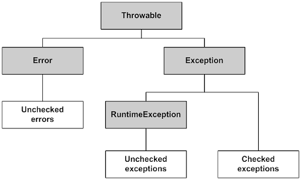

# 체크예외 언체크예외

## 예외와 에러

애플리케이션 실행 중 정상적인 흐름으로 동작하지 않는 상황입니다.

- 자바는 실행 중 발생할 수 있는 오류 상황을 예외와 에러로 구분합니다.
- 에러는 메모리부족, 스택오버플로우 같이 애플리케이션에서 복구가 불가능한 오류를 말합니다.
- 예외는 복구 가능성이 있는 오류로 애플리케이션에서 적절하게 예외처리 하여 정상흐름으로 동작하게 할 수 있습니다.
- 자바에서는 예외가 발생하는 상황에 예외 객체를 만들어 런타임에 던질 수 있습니다.

## 자바 예외 계층도



- 자바의 예외와 에러는 Throwable을 상속 받으며 Exception, Error로 나뉩니다.
- Error: 애플리케이션의 복구 불가능한 시스템 예외로 이 에러를 처리하려고 해서는 안됩니다.
- Exception 체크 예외: 애플리케이션에서 사용할 수 있는 최상위 예외 객체입니다.
  해당 객체의 하위 객체는 모두 체크예외입니다. (RuntimeException은 예외입니다. 예외의예외 ㅋㅋ)
- RuntimeException 언체크 예외: 해당 예외 객체와 자식 객체들은 모두 언체크 예외입니다.

## 예외 기본 규칙

- 예외는 기본적으로 잡아서 처리하거나(try..catch), 던져야합니다. (폭탄돌리기)

```java
1. 잡아서 처리

try {
    예외가 발생할 수 있는 로직..
} catch (발생하는예외 e) {
    log.info(e);
}

2. thorws로 메서드 호출 지점으로 예외를 던짐

void method() throws 발생하는예외 {
    예외가 발생할 수 있는 로직..
}
```

- 만약 계속해서 예외를 던진다면 예외 로그를 출력하면서 프로그램이 종료됩니다. 하지만 스프링 같은 애플리케이션이라면 예외 때문에 시스템이 종료되면 안됩니다. 그렇게 때문에 WAS가 해당 예외를 받아서 처리합니다.

## 체크 예외

**체크예외는 컴파일러 채크하는 예외**입니다. 체크예외는 반드시 잡아서 처리하거나 또는 호출 시점으로 던져야합니다.

**복구 가능성이 있는 예외이기 때문에 컴파일러가 처리를 강제화 합니다.**

- 체크 예외는 예외를 잡아서 처리할 수 없을때는 필수로 thorws를 선언해서 던져야합니다.
- 이러한 측징은 비즈니스 상으로 중요한 예외를 처리하는 것을 누락하지 않도록 컴파일 단계에서 잡아주는 안전장치가 될 수 있습니다.
- 하지만 모든 체크 예외를 반드시 처리해주어야하기 때문에 번거롭고 예외를 호출 지점으로 던졌을때 해당 예외에 의존관계도 함께 넘어가는 문제도 발생합니다.

## 언체크 예외

**언체크 예외는 컴파일러가 체크하지 않는 예외**입니다.

**복구 가능성이 없는 예외이기 때문에 컴파일러가 예외 처리를 강제화하지 않습니다.**

체크 예외와 비슷하지만 예외를 던지는 throws를 생략할 수 있습니다.

> RuntimeException과 그 자식 예외 객체들은 언체크 예외입니다.

- 예외를 잡아서 처리할 수 없을때 throws를 생략할 수 있습니다. 이런 특징으로 해당 예외에 대해 알 필요가 없는 계층에 대해 의존관계가 발생하지 않습니다.
- 하지만 개발자가 실수로 예외처리를 누락할 수 있다는 단점이 있습니다.

## 뭐가 더 좋을까?

- 기본적으로 언체크 예외를 사용해야합니다.
- 체크예외는 비즈니스적으로 반드시 의도적으로 처리를 해야하는 예외에만 사용해야합니다.

체크 예외는 문제가 많습니다.. 예외 누락을 컴파일 시점에서 체크해주기 때문에 예외 처리 누락을 방지할 수 있습니다.  
하지만 그렇기 때문에 항상 명시적으로 예외를 잡아서 처리하거나 throws로 던져야합니다.

만약 하위 계층의 객체에서 비즈니스 로직 중 체크 예외가 발생하여 던졌다면 상위 계층은 해당 예외를 처리할 수 없는 경우가 많습니다.  
그렇기 때문에 예외가 올라오면 다시 던집니다.. 이렇게 되면 예외를 던지는 코드가 중복된 뿐더러 해당 예외객체에 대한 불필요한 의존관계만 늘어나게됩니다. (해당 체크예외를 다른 예외로 바꾸면 상위 계층의 비즈니스 로직의 메서드에 throws 예외객체를 모두 변경해야합니다)

### 그냥 throws Exception 하면 안되나?

굳이 구체적인 예외 객체를 던지지 않고도 예외 객체의 최상위 객체인 Exception을 던져도 됩니다.  
하지만 이렇게 된다면 체크 예외를 컴파일러가 체크할 수 있는 기능이 사라지는거와 다름없습니다. 모든 예외를 다 던지기 때문에 체크 예외를 의도한대로 사용하는것이 아닙니다. (좋지 않은 패턴)

### 어떻게 살아가야할까

체크 예외의 이러한 문제점 때문에 대부분의 라이브러리도 기본적으로 언체크 예외를 사용합니다. 런타임 예외도 필요에 따라 잡을 수 있기 때문에 필요한 경우 잡아서 처리할 수도 있습니다. 그렇지 않으면 그냥 두면 알아서 던져지기 때문에 신경쓰지 않아도 됩니다.

(about with 스프링)

- controlleradvice와 같은 부분에서 언체크 예외를 깔끔하게 공통으로 처리할 수 있습니다.
- 추가로 체크 예외를 언체크 예외로 전환할 수도 있습니다. 이런 경우에는 기존 예외에 대한 정보를 꼭 넘겨주어야합니다.
- 기존 예외를 포함하지 않으면 해당 예외가 발생하였을때 스텍트레이스에 언체크 예외에 대한 정보 밖에 찍히지 않아 왜 이 예외가 발생했는지 알 수 없다.

```java
try {
    체크예외 발생 코드...
} catch (체크예외 e) {
    throw new RuntimeException(e); // 이렇게 넘겨주자
}
```
