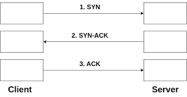

# TCP, UDP

## 인터넷 프로토콜 스택의 4계층 (TCP/IP 계층)

| TCP/IP                        |
| ----------------------------- |
| 애플리케이션 계층 - HTTP, FTP |
| 전송 계층 - TCP, UDP          |
| 인터넷 계층 - IP              |
| 네트워크 인터페이스 계층      |

IP 위에 TCP 기술을 얹어서 보안해준다고 생각하면 된다.

> ex) 채팅 프로그램으로 메시지를 보냈을 때

1. 프로프램이 메시지 데이터 생성
2. 애플리케이션 계층에서 SOKECT 라이브러리를 통해 전달
3. TCP 정보 생성, 메시지 데이터 포함
4. IP 패킷 생성, TCP 데이터 포함
5. LAN 카드를 거쳐서 인터넷 상으로 보내진다.

## TCP/IP 패킷 정보

데이터에 출발지 PORT, 도착지 PORT, 전송 제어, 순서, 검증 정보와 같은 TCP 정보가 포함되고

해당 TCP 정보를 포함한 IP 패킷(출발지 IP, 도착지 IP, 등..)이 생성된다.

`[IP [TCP [데이터]]]`

> 이런 느낌이다.

## TCP 특징

> 전송 제어 프로토콜 Transmission Control Protocol

- 연결 지향 - TCP 2 way handshake (가상 연결)
- 데이터 전달 보증
- 순서 보장

**신뢰할 수 있는 프로토콜**이며 **현재는 대부분 TCP를 사용**한다.

### TCP 3 way handshake

장치들 사이에서 논리적인 연결을 성립하기 위해서 3-way-handshake 과정을 거친다.

양쪽 모두 데이터를 전송할 준비가 되었다는걸 보장하고 데이터 전송 전 양쪽이 준비되어있다는걸 알 수 있게 한다.

- Client : 서버에 접속을 요청하는 `SYN` 패킷을 보내고 응답을 기다리는 `SYN_SENT` 상태가 된다.
- Server : `SYN` 요청을 받고 요청을 수락한다는 `ACK`와 `SYN` 패킷을 보내고 `SYN_RECEIVED` 상태가 된다.
- Client : 클라이언트는 서버에 `ACK`을 보내고 이후로 부터 연결이 이루어졌다고 판단하고 데이터가 오가게된다.

> 마지막 ACK과 함께 데이터 전송도 가능하다.

### 데이터 전달 보증

클라이언트에서 데이터를 서버에 보냈을 때 서버에서 잘 받았다는 응답을 해준다.

응답이 오지 않을 경우 문제가 생겼다고 판단할 수 있다.

### 순서 보장

클라이언트에서 데이터를 보낼때 데이터가 너무 커서 순서가 작성된 여러개의 패킷으로 넘겨 주었을 때

해당 패킷들을 서버에서 받았을 때 순서에 맞지 않는 패킷이 온다면

기본적으로 해당 패킷부터 다시 보내달라고 클라이언트에 요청을 보낸다.

## UDP

> 사용자 데이터 프로토콜 User Datagram Protocol

- 거의 기능이 없다!
- 연결 지향 X, 데이터 전달 보증 X, 순서 보장 X
- 데이터 전달, 순서가 보장되진 않지만 단순하고 빠르다

* IP와 거의 같다. (PORT, 체크섬 정도 추가됨)
* 애플리케이션 추가 작업 필요

TCP는 너무 오래걸린다.

TCP는 인터넷이 다 TCP 기반이기 때문에 손을 댈 수 없다.
UDP를 사용해서 애플리케이션 단계에서 원하는대로 최적화하여 변경하여 사용할 수 있다.
